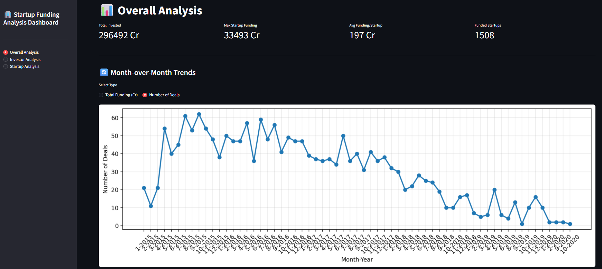
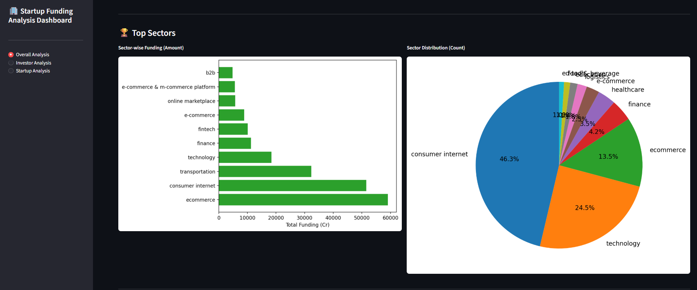
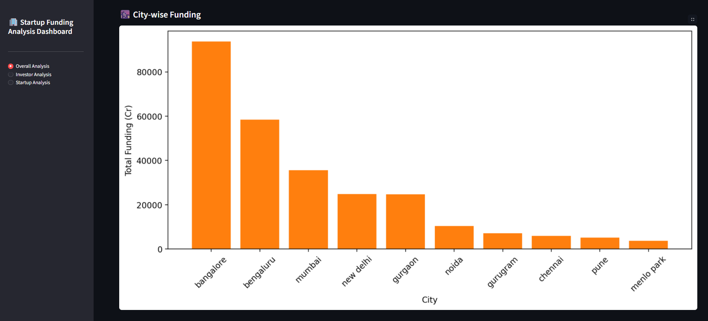
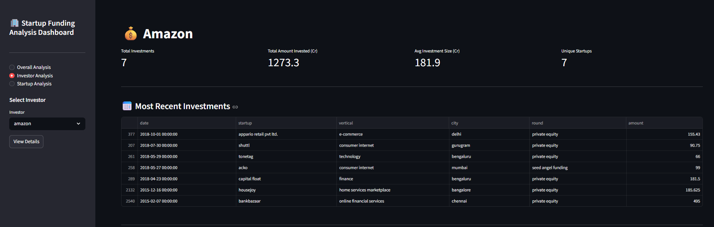
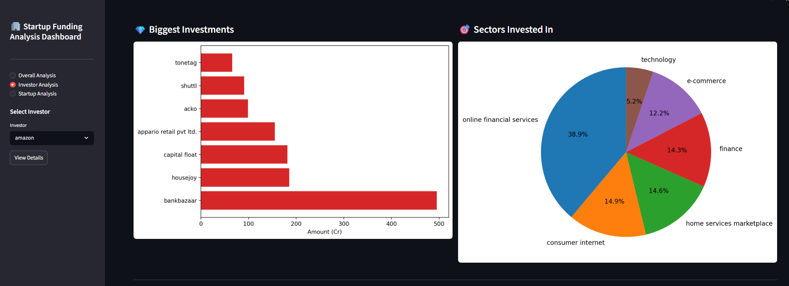
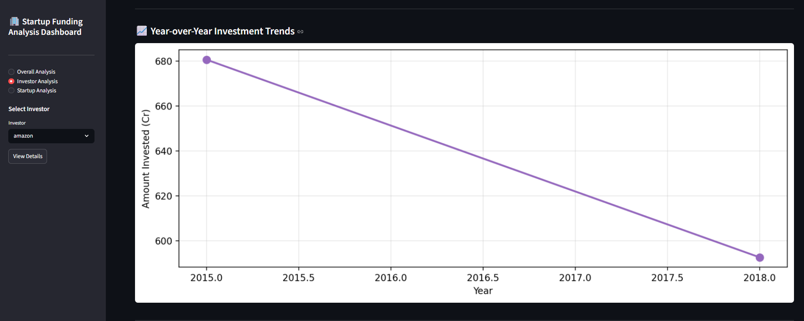
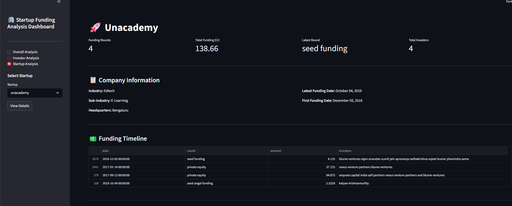
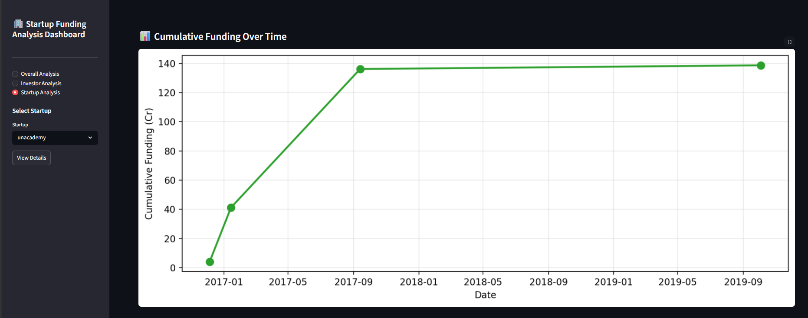
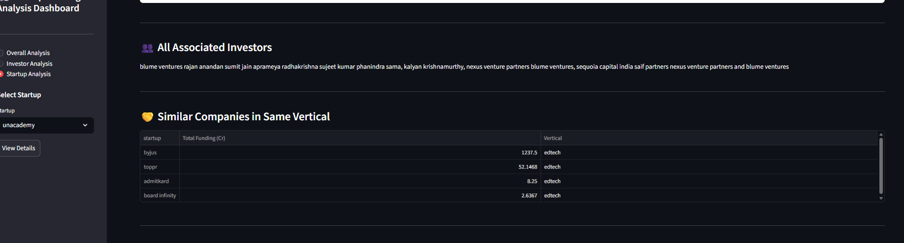

<div align="center">


<br/>

[](https://git.io/typing-svg)

<br/>

[](https://indian-startup.streamlit.app/)
&nbsp;
[](https://streamlit.io/)
&nbsp;
[](https://python.org/)

<br/>


&nbsp;

&nbsp;

&nbsp;

&nbsp;


<br/><br/>

> 🏢 A comprehensive **Streamlit-based interactive dashboard** for analyzing Indian startup funding data
> with powerful insights into startups, investors, and market trends.

<br/>

[🌐 **Live Demo**](https://indian-startup.streamlit.app/) 

</div>

---

## 🌐 Live Demo

<div align="center">

### ✨ Access the Live Dashboard Here:

### 👉 [https://indian-startup.streamlit.app/](https://indian-startup.streamlit.app/)

The dashboard is deployed and live on **Streamlit Cloud**.
You can access it directly from your browser without any setup!

[](https://indian-startup.streamlit.app/)

</div>

---

## 📋 Project Overview

This dashboard provides **three powerful perspectives** for understanding startup ecosystem dynamics:

<div align="center">

| # | View | What You'll Find |
|:---:|---|---|
| 1️⃣ | **Overall Analysis** | Market-wide insights and trends |
| 2️⃣ | **Investor Analysis** | Portfolio details and investment patterns |
| 3️⃣ | **Startup Analysis** | Company-specific funding history and metrics |

</div>

---

## 📁 Project Structure

```
startup_dashboard/
│
├── 📄 app.py                    # Main Streamlit application
├── 📦 requirements.txt          # Python dependencies
├── 🗂️  startup_cleaned.csv      # Cleaned dataset (primary data source)
├── 🗂️  startup_funding.csv      # Raw dataset (backup)
├── 📝 needs.txt                 # Project planning & references
└── 📖 README.md                 # This file
```

---

## 📸 Dashboard Screenshots

### 🔹 Overall Dashboard

<p align="center">



</p>

### 🔹 Investor Analysis

<p align="center">



</p>

### 🔹 Startup Analysis

<p align="center">



</p>

---

## ✨ Key Features

<table>
<tr>
<td valign="top" width="50%">

### 📊 &nbsp;Overall Analysis
> *The big picture of Indian startup funding*

- 📈 Month-over-month funding trends
- 🏙️ Top funded cities & sectors
- 💰 Funding type distribution (Seed, Series A/B/C...)
- 🔥 Heatmaps & time-series visualizations

</td>
<td valign="top" width="50%">

### 👤 &nbsp;Investor Analysis
> *Deep-dive into any investor's portfolio*

- 🔍 Search any investor by name
- 📋 Full investment portfolio view
- 🏭 Sector & stage preferences
- 🤝 Co-investor network insights

</td>
</tr>
<tr>
<td valign="top" width="50%">

### 🚀 &nbsp;Startup Analysis
> *Detailed profile for every startup*

- 📜 Complete funding round history
- 💵 Total funds raised breakdown
- 👥 Investor list per company
- 📅 Timeline of funding milestones

</td>
<td valign="top" width="50%">

### ⚡ &nbsp;Built for Exploration
> *Intuitive, fast, and interactive*

- 🎛️ Sidebar filters for instant drill-down
- 📱 Responsive layout for all screen sizes
- 🌐 Zero setup — runs live in your browser
- 📤 Exportable charts and data tables

</td>
</tr>
</table>

---

## 🛠️ Tech Stack

<div align="center">

| | Technology | Purpose |
|:---:|---|---|
| 🖥️ | **Streamlit** | Web app framework & deployment |
| 🐼 | **Pandas** | Data wrangling & analysis |
| 📊 | **Plotly** | Interactive charts & graphs |
| 📉 | **Matplotlib / Seaborn** | Static visualizations |
| ☁️ | **Streamlit Cloud** | Free hosting & deployment |

</div>

---

## ⚙️ Run Locally

**① Clone the repository**
```bash
git clone https://github.com/your-username/startup-dashboard.git
cd startup-dashboard
```

**② Install dependencies**
```bash
pip install -r requirements.txt
```

**③ Launch the app**
```bash
streamlit run app.py
# ✅ App opens at http://localhost:8501
```

---

## 📊 Dataset

The dashboard is powered by `startup_cleaned.csv` — a cleaned and preprocessed version of Indian startup funding records.

| Column | Description |
|---|---|
| `startup_name` | Name of the startup |
| `industry_vertical` | Sector / Industry |
| `city` | Headquarter city |
| `investors_name` | Names of investors |
| `investment_type` | Seed / Series A / B / C etc. |
| `amount_in_usd` | Funding amount in USD |
| `date` | Date of funding round |

---

---

<div align="center">

## ⭐ Found it useful? Give it a star!

*"Data is the new oil — but only if you can refine it."*

<br/>

[](https://indian-startup.streamlit.app/)

<br/>


</div>
